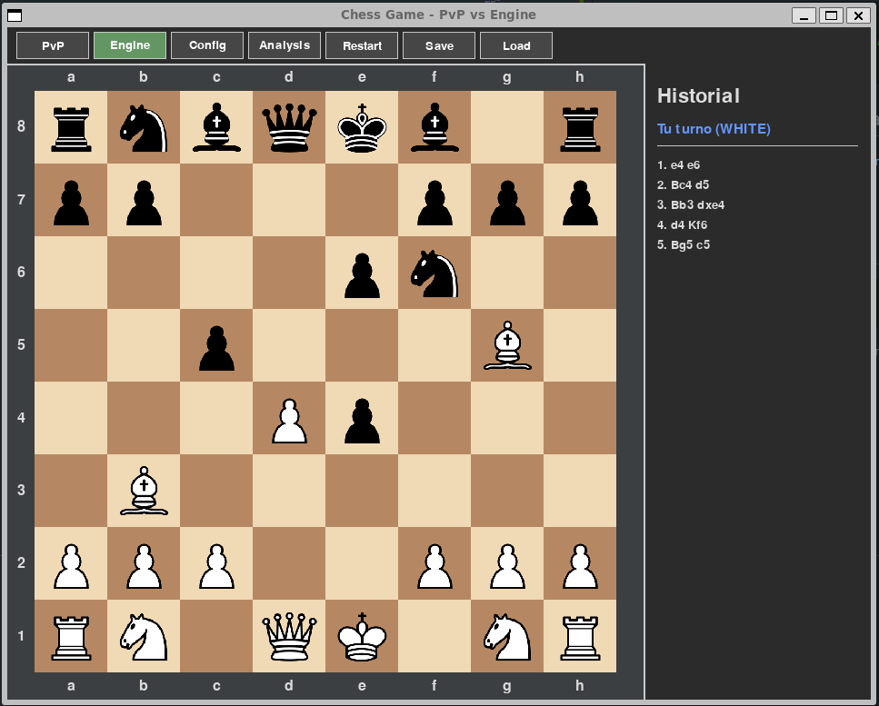

# Chess Game with Engine Analysis

A feature-rich chess game built with Python and pygame, featuring both Player vs Player (PvP) and Player vs Engine modes with real-time analysis capabilities.



## Features

### Game Modes
- **Player vs Player (PvP)**: Classic chess for two human players
- **Player vs Engine**: Play against the powerful Stockfish chess engine

### Engine Integration
- **Stockfish Support**: Industry-standard chess engine integration
- **Configurable Difficulty**: 20 difficulty levels (Beginner to Master)
- **Estimated ELO Ratings**: 800-2800+ ELO range
- **Real-time Analysis**: Live position evaluation and move suggestions

### User Interface
- **Professional Dark Theme**: Modern, eye-friendly interface
- **PNG Piece Graphics**: High-quality piece images with Unicode fallback
- **Board Notation**: Standard algebraic notation (a-h, 1-8)
- **Move History**: Complete game notation with check/checkmate indicators
- **Visual Indicators**: Highlighted valid moves, captures, and check situations

### Analysis Features
- **Position Evaluation**: Real-time centipawn evaluation
- **Win Probability**: WDL (Win/Draw/Loss) statistics visualization
- **Best Move Suggestions**: Top engine recommendations
- **Mate Detection**: Forced mate sequence identification

### Game Management
- **Save/Load Games**: Persistent game state storage
- **Move Validation**: Full chess rule enforcement including check/checkmate
- **Turn Indicators**: Clear visual feedback for current player

## Installation

### Prerequisites
```bash
pip install -r requirements.txt
```

### Installing Stockfish Engine
For engine mode, you need to install Stockfish. See [install_stockfish.md](install_stockfish.md) for detailed instructions.

**Quick install on Ubuntu/Debian:**
```bash
sudo apt update
sudo apt install stockfish
```

### Running the Game
```bash
python chess.py
```

## Controls

### Basic Gameplay
1. **Select Piece**: Click on a piece of your color
2. **Move Piece**: Click on a highlighted valid square
3. **Cancel Selection**: Click elsewhere to deselect

### Interface Buttons
- **PvP**: Switch to Player vs Player mode
- **Engine**: Switch to Player vs Engine mode (requires Stockfish)
- **Config**: Open difficulty configuration panel
- **Analysis**: Toggle real-time position analysis
- **Restart**: Start a new game
- **Save**: Save current game state
- **Load**: Load previously saved game

### Difficulty Configuration
- **Slider**: Drag to adjust engine strength (1-20)
- **Preset Buttons**: Quick difficulty selection
  - Easy (Level 5) - ~1300 ELO
  - Medium (Level 10) - ~1800 ELO
  - Hard (Level 15) - ~2300 ELO
  - Maximum (Level 20) - ~2800+ ELO

## File Structure

```
chess-game/
├── chess.py                    # Main game file
├── chess_engine_adapter.py     # Engine abstraction layer
├── chess_analysis.py           # Analysis components
├── win_probability_widget.py   # Probability visualization
├── requirements.txt            # Python dependencies
├── install_stockfish.md        # Stockfish installation guide
├── README.md                   # This file
└── pieces-basic-png/           # Piece graphics (optional)
    ├── white-king.png
    ├── white-queen.png
    └── ... (other piece images)
```

## Technical Architecture

### Core Components

**ChessGame**: Main game logic and UI rendering
- Board state management
- Move validation and execution
- UI event handling
- Game mode switching

**ChessEngineAdapter**: Engine integration layer
- Stockfish communication via UCI protocol
- FEN position conversion
- Move parsing and validation
- Engine configuration management

**ChessAnalysisManager**: Real-time analysis system
- Position evaluation
- Move suggestion
- Win probability calculation
- Analysis display coordination

**WinProbabilityWidget**: Visualization component
- Animated probability displays
- Multiple visualization modes
- Smooth transition effects

### Engine Integration
The game uses the Universal Chess Interface (UCI) protocol to communicate with Stockfish:
- **Position Analysis**: Converts board state to FEN notation
- **Move Generation**: Gets best moves with evaluation scores
- **WDL Statistics**: Win/Draw/Loss probability calculations
- **Configurable Strength**: Skill level and depth adjustment

## Game Rules Implementation

### Standard Chess Rules
- All piece movement patterns (pawn, rook, knight, bishop, queen, king)
- Check and checkmate detection
- Move validation preventing king exposure
- Turn-based gameplay

### Visual Feedback
- **Selected Piece**: Yellow highlight border
- **Valid Moves**: Green circles on empty squares
- **Capture Moves**: Red highlight borders
- **King in Check**: Red border around threatened king

### Notation System
- Standard algebraic notation (e.g., "e4", "Nf3", "Qxd5")
- Check indicator: "+" (e.g., "Qd8+")
- Checkmate indicator: "#" (e.g., "Qh7#")

## Dependencies

### Required Python Packages
```
pygame>=2.0.0     # Game engine and UI
stockfish>=3.28.0 # Chess engine interface
```

### Optional Dependencies
- **Piece Graphics**: PNG images in `pieces-basic-png/` directory
- **Stockfish Binary**: Chess engine executable

## Performance Considerations

- **Engine Calls**: Asynchronous analysis to prevent UI blocking
- **Memory Management**: Efficient board representation
- **Graphics**: Optimized rendering with minimal redraws
- **Analysis Depth**: Configurable to balance speed vs accuracy

## Troubleshooting

### Common Issues

**Engine button disabled**:
- Ensure Stockfish is installed and in PATH
- Check installation with: `stockfish` command
- See [install_stockfish.md](install_stockfish.md) for help

**Missing piece graphics**:
- Game falls back to Unicode chess symbols
- Download piece PNG files to `pieces-basic-png/` directory

**Performance issues**:
- Reduce analysis depth in engine configuration
- Disable real-time analysis for slower systems
- Lower engine difficulty level

### Error Messages
- "Stockfish not available": Install Stockfish engine
- Check console output for detailed error information

## Future Enhancements

### Planned Features
- **Opening Book**: Common opening move database
- **Endgame Tablebase**: Perfect endgame play
- **Time Controls**: Clock-based gameplay
- **Online Play**: Network multiplayer support
- **Tournament Mode**: Multi-game tournaments
- **Puzzle Mode**: Tactical training exercises

### Advanced Analysis
- **Multi-PV Analysis**: Multiple best move lines
- **Depth Progression**: Incremental analysis display
- **Historical Analysis**: Game review and annotation
- **Position Database**: Opening and endgame databases

## Contributing

### Development Setup
1. Clone the repository
2. Install dependencies: `pip install -r requirements.txt`
3. Install Stockfish engine
4. Run: `python chess.py`

### Code Style
- Follow PEP 8 Python style guidelines
- Use type hints where applicable
- Document functions with docstrings
- Maintain modular architecture

## License

This project is open source. Feel free to modify and distribute according to your needs.

## Acknowledgments

- **Stockfish Team**: For the powerful chess engine
- **pygame Community**: For the excellent game development library
- **Chess.com**: For inspiration on UI design and features

---

**Enjoy playing chess with advanced engine analysis!**